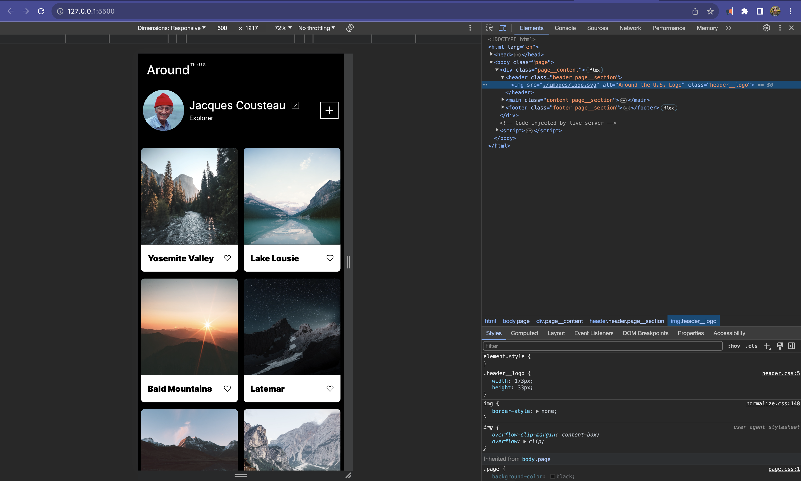
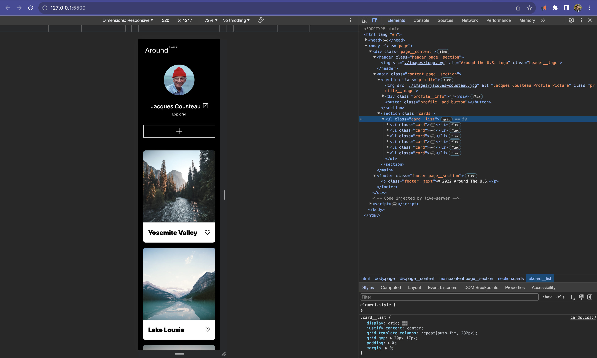

# Project 3: Around The U.S.

### Overview  

* Description 
* Figma  
* Images  
  
**Description**
  
This is my first project working with Figma and being able to fully delve into what I've learned previously. This project contains elements of Media Queries, Grids, Flex elements and a Responisve Design.
  
**Figma**  
  
* [Link to the project on Figma](https://www.figma.com/file/ii4xxsJ0ghevUOcssTlHZv/Sprint-3%3A-Around-the-US?node-id=0%3A1)  
  
**Images**  
  Full Page View

Mid-transition View

Mobile View

(https://github.com/A-Mrtz/se_project_aroundtheus.git)
